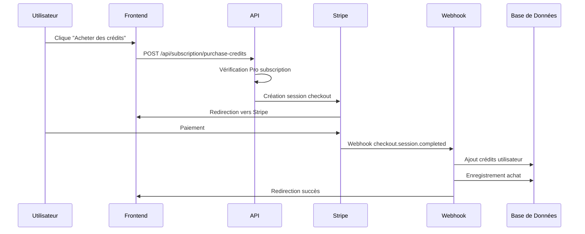
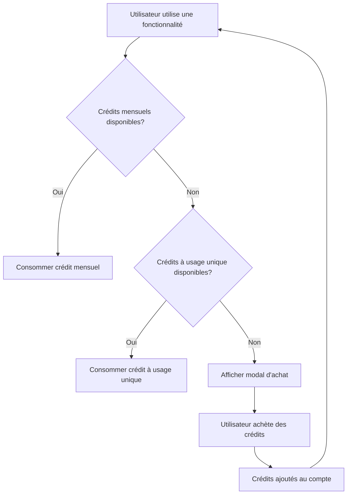

# Système Complet d'Achat de Crédits - Minato Pro

## 🎯 Vue d'ensemble

Ce document décrit l'implémentation complète du système d'achat de crédits à usage unique pour les utilisateurs Pro de Minato. Quand un utilisateur dépasse ses quotas mensuels (30 images, 20 vidéos, 20 recordings, 50 leads), il peut acheter des packs de crédits supplémentaires.

## 📋 Fonctionnalités Implémentées

### 1. **Modal d'Achat de Crédits** (`CreditsPurchaseModal.tsx`)
- Interface utilisateur moderne avec design Minato
- Affichage des packs disponibles avec prix et économies
- Gestion des abonnements expirants
- Intégration Stripe pour le paiement

### 2. **API Route d'Achat** (`/api/subscription/purchase-credits`)
- Validation de l'authentification et du plan Pro
- Création de sessions Stripe pour le paiement
- Gestion des métadonnées pour le webhook
- Redirection vers Stripe Checkout

### 3. **Webhook Stripe Étendu** (`/api/stripe-webhooks/route.ts`)
- Traitement des achats de crédits (`credits_purchase`)
- Ajout automatique des crédits au compte utilisateur
- Enregistrement des achats dans la base de données
- Prévention des doublons

### 4. **Service de Gestion des Crédits** (`CreditsService.ts`)
- Vérification des quotas et crédits disponibles
- Consommation intelligente (priorité aux crédits à usage unique)
- Nettoyage automatique des crédits expirés
- Historique des achats

### 5. **Base de Données** (`credit_purchases` table)
- Enregistrement de tous les achats
- Suivi de la validité des crédits
- Sécurité avec RLS (Row Level Security)
- Index pour les performances

## 🏗️ Architecture du Système

### Flux d'Achat de Crédits



### Gestion des Crédits



## 💰 Packs de Crédits Disponibles

### Images
- **Pack Images** : 15 crédits - $15
- **Pack Images Plus** : 30 crédits - $25 (17% d'économie)
- **Pack Images Pro** : 50 crédits - $35 (30% d'économie)

### Vidéos
- **Pack Vidéos** : 10 crédits - $15
- **Pack Vidéos Plus** : 20 crédits - $25 (17% d'économie)
- **Pack Vidéos Pro** : 35 crédits - $35 (30% d'économie)

### Recordings
- **Pack Recordings** : 10 crédits - $15
- **Pack Recordings Plus** : 20 crédits - $25 (17% d'économie)
- **Pack Recordings Pro** : 35 crédits - $35 (30% d'économie)

### Leads
- **Pack Leads** : 25 crédits - $15
- **Pack Leads Plus** : 50 crédits - $25 (17% d'économie)
- **Pack Leads Pro** : 100 crédits - $35 (30% d'économie)

## 🔧 Intégration dans les Composants Existants

### 1. **Génération d'Images**
```typescript
// Dans use-image-generation.ts
const { openPurchaseModal, CreditsPurchaseModalComponent } = useCreditsPurchase({
  feature: 'images',
  currentUsage: user?.monthly_usage?.images || 0,
  limit: user?.plan_type === 'PRO' ? 30 : 2,
  subscriptionEndDate: user?.subscription_end_date
});
```

### 2. **Génération de Vidéos**
```typescript
// Dans use-video-generation.ts
const { openPurchaseModal, CreditsPurchaseModalComponent } = useCreditsPurchase({
  feature: 'videos',
  currentUsage: user?.monthly_usage?.videos || 0,
  limit: user?.plan_type === 'PRO' ? 20 : 1,
  subscriptionEndDate: user?.subscription_end_date
});
```

### 3. **Recordings**
```typescript
// Dans les composants d'enregistrement
const { openPurchaseModal, CreditsPurchaseModalComponent } = useCreditsPurchase({
  feature: 'recordings',
  currentUsage: user?.monthly_usage?.recordings || 0,
  limit: user?.plan_type === 'PRO' ? 20 : 3,
  subscriptionEndDate: user?.subscription_end_date
});
```

## 🗄️ Structure de la Base de Données

### Table `credit_purchases`
```sql
CREATE TABLE credit_purchases (
  id UUID PRIMARY KEY,
  user_id UUID REFERENCES auth.users(id),
  stripe_checkout_session_id TEXT UNIQUE,
  credit_type TEXT CHECK (credit_type IN ('images', 'videos', 'recordings', 'leads')),
  pack_id TEXT,
  credits_purchased INTEGER,
  amount_paid INTEGER,
  purchase_date TIMESTAMPTZ,
  valid_until TIMESTAMPTZ,
  status TEXT DEFAULT 'pending',
  created_at TIMESTAMPTZ,
  updated_at TIMESTAMPTZ
);
```

### Table `users` (mise à jour)
```sql
-- Ajout du champ one_time_credits
ALTER TABLE users ADD COLUMN one_time_credits JSONB DEFAULT '{"images": 0, "videos": 0, "recordings": 0, "leads": 0}';
```

## 🔒 Sécurité et Validation

### 1. **Authentification**
- Vérification de l'utilisateur connecté
- Validation du plan Pro actif
- Vérification de la non-expiration de l'abonnement

### 2. **Prévention des Doublons**
- Vérification des sessions Stripe déjà traitées
- Idempotence des webhooks
- Validation des métadonnées

### 3. **Sécurité des Données**
- RLS (Row Level Security) sur la table `credit_purchases`
- Politiques d'accès restrictives
- Validation des types de crédits

## 📊 Monitoring et Logs

### Logs Implémentés
- Création des sessions d'achat
- Traitement des webhooks
- Consommation des crédits
- Erreurs et exceptions

### Métriques à Surveiller
- Taux de conversion des achats
- Utilisation des crédits par type
- Revenus générés par les packs
- Expiration des crédits

## 🚀 Déploiement

### 1. **Migration de Base de Données**
```bash
# Appliquer la migration
psql -d your_database -f migrations/add_credit_purchases_table.sql
```

### 2. **Configuration Stripe**
```bash
# Créer les produits et prix
node scripts/setup-minato-pro-products.js
```

### 3. **Mise à Jour des Price IDs**
```typescript
// Dans app/api/subscription/purchase-credits/route.ts
const STRIPE_PRICE_IDS: Record<string, string> = {
  'price_images_15': 'price_1OqX8X2eZvKYlo2C1234567890', // Remplacer par les vrais IDs
  // ... autres IDs
};
```

## 🧪 Tests

### Tests à Implémenter
1. **Tests d'API**
   - Création de sessions d'achat
   - Validation des quotas
   - Gestion des erreurs

2. **Tests de Webhook**
   - Traitement des paiements réussis
   - Gestion des doublons
   - Ajout des crédits

3. **Tests d'Intégration**
   - Flux complet d'achat
   - Consommation des crédits
   - Expiration des crédits

## 📈 Évolutions Futures

### Fonctionnalités Possibles
1. **Packs Personnalisés**
   - Création de packs sur mesure
   - Prix dynamiques selon l'usage

2. **Programme de Fidélité**
   - Points de fidélité
   - Réductions progressives

3. **Analytics Avancés**
   - Dashboard d'utilisation
   - Prédiction des besoins

4. **Notifications**
   - Alertes de crédits faibles
   - Rappels d'expiration

## 🔧 Maintenance

### Tâches Régulières
1. **Nettoyage des Crédits Expirés**
   ```sql
   SELECT cleanup_expired_credits();
   ```

2. **Monitoring des Webhooks**
   - Vérification des échecs
   - Reprocessing si nécessaire

3. **Mise à Jour des Prix**
   - Synchronisation avec Stripe
   - Gestion des changements

## 📞 Support

### Problèmes Courants
1. **Crédits non ajoutés après achat**
   - Vérifier les logs du webhook
   - Contrôler la session Stripe

2. **Erreur de quota**
   - Vérifier le plan utilisateur
   - Contrôler les crédits disponibles

3. **Problème de paiement**
   - Vérifier la configuration Stripe
   - Contrôler les métadonnées

---

**Note** : Ce système est conçu pour être robuste, sécurisé et évolutif. Il respecte les meilleures pratiques de Stripe et assure une expérience utilisateur fluide. 